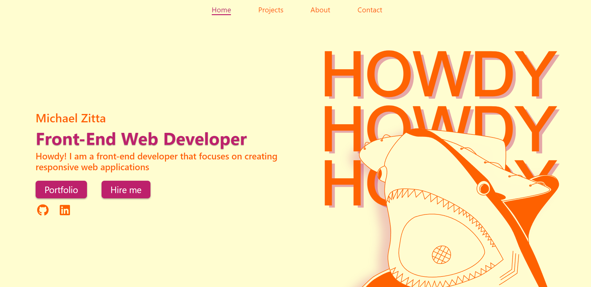
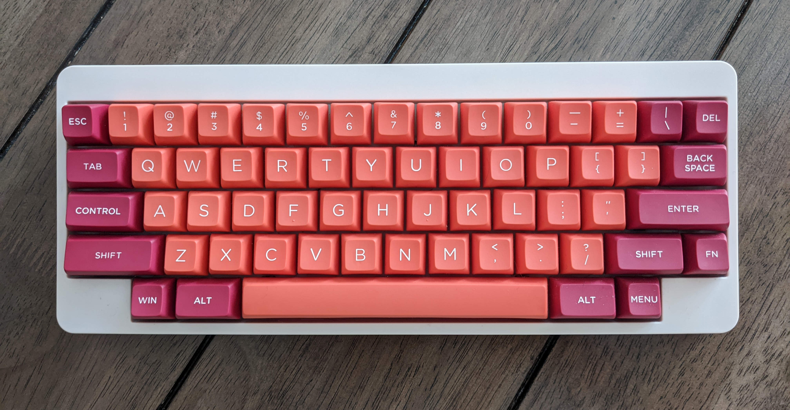
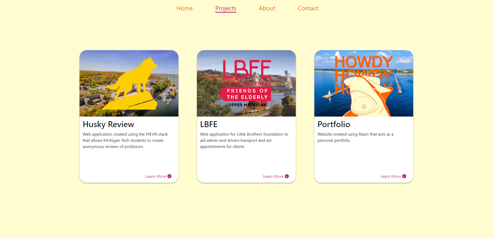
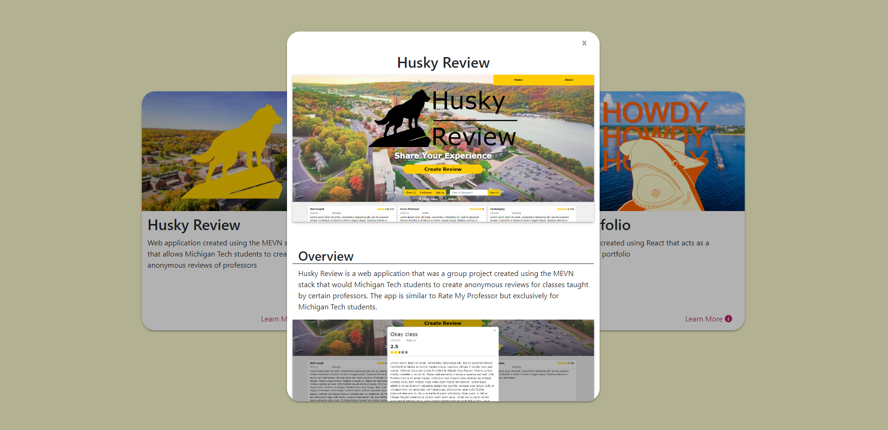
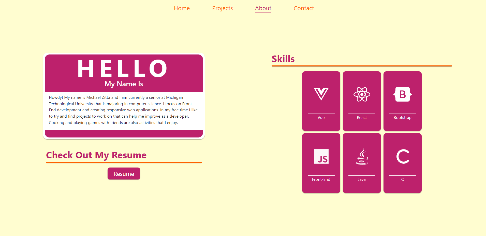
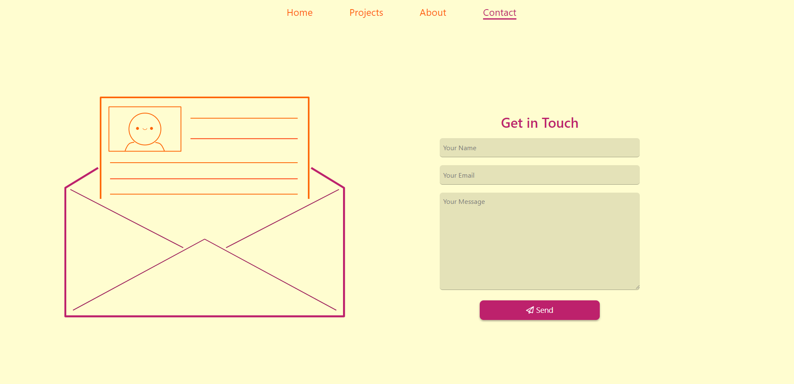
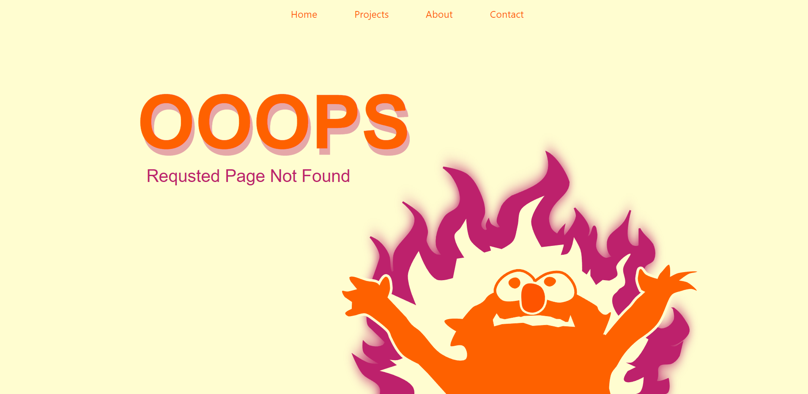
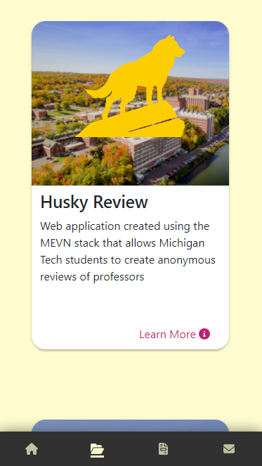
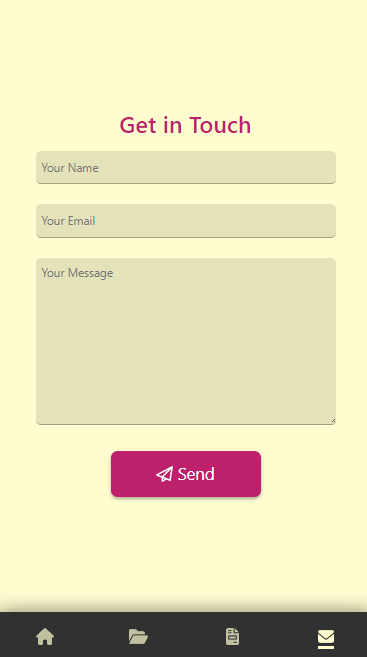
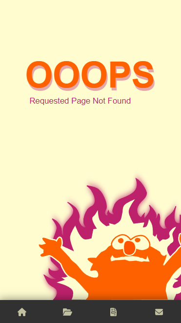

<h1><strong>Portfolio Site</strong></h1>

<h2><strong>Overview</strong></h2>

This is a personal website, which was created using React.js that acts as an online portfolio. The initial goal for the site
was to make something with a unique, yet nice looking, style and theme(the color scheme was derived from my keyboard). Another goal when creating the site was to make it so
the user did not have to scroll at all when viewing the site on a desktop computer.

 
 

<h3><strong>Technical Details</strong></h3>

<ul>
<li>Framework: React.js</li>
 <li>Libraries: 
<ul>
<li>React Bootstrap</li>
<li>React Router</li>
<li>Framer Motion</li>
<li>EmailJS</li>
</ul>
</li>
 <li>Software Used:
<ul>
<li>VS Code</li>
<li>Git Hub</li>
<li>Inkscape</li>
<li>Gimp</li>
</ul>
</li>
 <li>Deployed With: Netlify</li>
</ul>

 

<h3><strong>What Went Well?</strong></h3>

Overall the website turned out looking good and was a great learning project. The goal of the user not having to scroll on desktop was met. Additionally, I learned
a lot about React.js and plan to keep learning/practicing with React.js. The site is also responsive so it looks nice on desktop and mobile.

<h3><strong>What Could Be Improved?</strong></h3>

As good as the project turned out there are a few issues with it. The first issue is that the orange on the cream does not meet the contrast requirements to be WCAG level AA.
To fix this a new color scheme would have to be used. Another problem is that some of the images take too long to load, even after going back and compressing the images a
few of them take a little while to load. The final issue with the site is how it appears on the iOS version of Safari, occasionally the navbar will become unfixed and the
user will have to scroll to see it.

 
<h3><strong>Main Takeaways</strong></h3>
<table>
<tr>
<th >
The Good
</th>
<th>
The Bad
</th>
</tr>
<tr>
<td>
<ul>
<li>Learned a lot about React.js</li>
<li>No scrolling on desktop</li>
<li>Website looks nice</li>
</ul>
</td>

<td>
<ul>
<li>Not WCAG level AA</li>
<li>Minor navbar bug on iOS Safari</li>
<li>Image loading times</li>
</ul>
</td>
</tr>
</table>

 
 

<h2>The Site Is Live!<h2>

**[Click Here To View The Live Project](https://www.zitta.dev/)**

 
 

<h2><strong>Screenshots</strong></h2>

<h2 align="center">Desktop Views</h2> 
 
 
 
 
 
 
 

<h2 align="center">Mobile Views</h2> 

 

 

 

 

 

