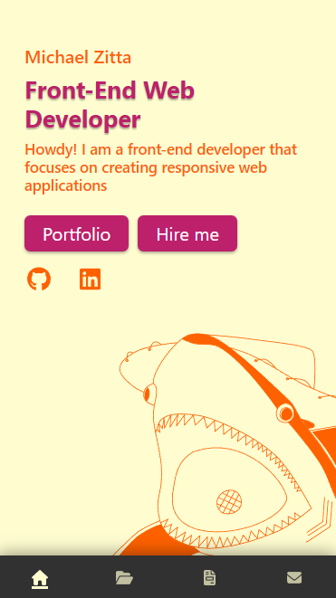

# Portfolio Site

### Description
 

This is a personal website that was created using React.js that acts as a portfolio 
The inspiration for the theme of the website came from my keyboard. 
The main goal of this project was to learn React.js and make an easy to use responsive website.

## Screenshots

### Desktop View

 
 

### Mobile View

